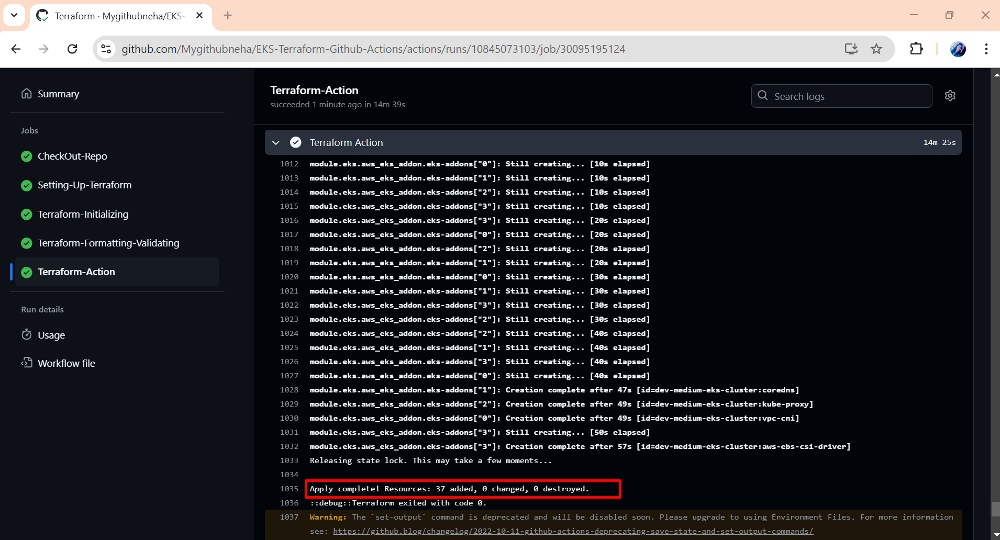
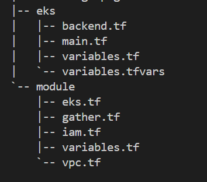

## 🚀 Configuring Production-Ready EKS Clusters with Terraform and GitHub Actions
In this project, we will configure a Production-Ready EKS Cluster using Terraform (an Infrastructure-as-Code tool) and automate it using GitHub Actions for CI/CD.

## 🌟 Why GitHub Actions?
GitHub Actions is one of the hottest tools in the DevOps space right now! While Jenkins is a solid option, GitHub Actions makes automating workflows even easier, especially for projects hosted on GitHub.

## 🛠 What’s EKS?
EKS (Elastic Kubernetes Service) is an AWS service that helps deploy and manage Kubernetes clusters on the cloud. It's a powerful service for cloud-native applications, and today, we're setting it up the right way, using best industry practices!

## 🚧 Prerequisites
Before jumping into configuring the EKS Cluster, make sure you have:

AWS Account with access key and secret key.
AWS Credentials (Access Key and Secret Key with Administrator permissions).
Terraform Knowledge for writing infrastructure as code.
Basic understanding of YAML for creating GitHub Actions workflows.
🗂 Directory Structure
Here's how the project directory is organized:



## 🗂 Directory Structure

Here's how the project directory is organized:




### 🚀 Steps to Configure the EKS Cluster

### 1. Terraform Configuration

We are using a modular approach for Terraform configurations. This helps keep things organized and reusable.
Resources like EKS, IAM, and VPC are managed via modules.

### 2. Adding AWS Secrets to GitHub

Head to your repository’s Settings > Secrets and variables.
Add your AWS Access Key and Secret Access Key for secure access to AWS services from GitHub Actions.

### 3. Creating the GitHub Actions Workflow

Create a directory: .github/workflows.

Inside this directory, create a file named terraform.yaml to define the workflow.

Example YAML for GitHub Actions:

```yaml

name: 'Terraform'

on:
  workflow_dispatch:
    inputs:
      tfvars_file:
        description: 'Path to the .tfvars file'
        required: true
        default: 'variables.tfvars'
      action:
        type: choice
        description: 'Apply or Destroy'
        options:
        - plan
        - apply
        - destroy
        required: true
        default: 'apply'

env:
      AWS_REGION: ap-south-1
      AWS_ACCESS_KEY_ID: ${{ secrets.AWS_ACCESS_KEY_ID }}
      AWS_SECRET_ACCESS_KEY: ${{ secrets.AWS_SECRET_ACCESS_KEY }}

permissions:
  contents: read

jobs:
  

  CheckOut-Repo:
    runs-on: ubuntu-latest
    environment: production

    defaults:
      run:
        shell: bash
        working-directory: eks

    env:
      AWS_REGION: us-east-1
      AWS_ACCESS_KEY_ID: ${{ secrets.AWS_ACCESS_KEY_ID }}
      AWS_SECRET_ACCESS_KEY: ${{ secrets.AWS_SECRET_ACCESS_KEY }}
    
    
    steps:
    # Checkout the repository to the GitHub Actions runner
    - name: Checkout
      uses: actions/checkout@v4

  Setting-Up-Terraform:
    runs-on: ubuntu-latest
    
    needs: CheckOut-Repo

    steps:
    # Install the latest version of Terraform CLI and configure the Terraform CLI configuration file with a Terraform Cloud user API token
    - name: Setup Terraform
      uses: hashicorp/setup-terraform@v1
      with:
        terraform_version: 1.8.4

  Terraform-Initializing:
    runs-on: ubuntu-latest

    needs: Setting-Up-Terraform

    steps:

    - name: Setup Terraform
      uses: hashicorp/setup-terraform@v1
      with:
        terraform_version: 1.8.4
        
    - name: Checkout repository
      uses: actions/checkout@v4
      
    # Initialize a new or existing Terraform working directory by creating initial files, loading any remote state, downloading modules, etc.
    - name: Terraform Init
      working-directory: eks
      run: terraform init

  Terraform-Formatting-Validating:
    runs-on: ubuntu-latest
    needs: Terraform-Initializing

    steps:
        
    - name: Checkout repository
      uses: actions/checkout@v4
      
    - name: Setup Terraform
      uses: hashicorp/setup-terraform@v1
      with:
        terraform_version: 1.8.4
        
    - name: Terraform Init
      working-directory: eks
      run: terraform init
      
    # Checks that all Terraform configuration files adhere to a canonical format
    - name: Terraform Format
      working-directory: eks
      run: terraform fmt

    - name: Terraform Validate
      working-directory: eks
      run: terraform validate

  Terraform-Action:
    runs-on: ubuntu-latest
    needs: Terraform-Formatting-Validating
    
    steps:

    - name: Checkout repository
      uses: actions/checkout@v4

    - name: Setup Terraform
      uses: hashicorp/setup-terraform@v1
      with:
        terraform_version: 1.8.4

    - name: Terraform Init
      working-directory: eks
      run: terraform init

      
    - name: Terraform Plan
      if: ${{ github.event.inputs.action  == 'plan' }}
      working-directory: eks
      # Generates an execution plan for Terraform
      run: |
        terraform plan -var-file=${{ github.event.inputs.tfvars_file }} -input=false

    
      # Apply the Terraform Configuration according to the parameter
    - name: Terraform Action
      if: ${{ github.event.inputs.action  == 'apply' }}
      working-directory: eks
      run: terraform ${{ github.event.inputs.action }} -auto-approve -var-file=${{ github.event.inputs.tfvars_file }} -input=false

    - name: Terraform Destroy
      if: ${{ github.event.inputs.action == 'destroy' }}
      working-directory: eks
      run: terraform ${{ github.event.inputs.action }} -auto-approve -var-file=${{ github.event.inputs.tfvars_file }} -input=false
```

## 🔑 Best Practices

1. Avoid using Administrator Access for AWS credentials. Always follow the principle of least privilege.

2. Consider setting up CloudWatch for monitoring your EKS Cluster.

## 🌐 GitHub Repository

For detailed code and resources, check out my GitHub: 
https://github.com/Mygithubneha/EKS-Terraform-Github-Actions.git

## 🚀 Conclusion

We’ve set up a Production-Ready EKS Cluster with Terraform and automated the deployment using GitHub Actions. I hope this guide helps you in your DevOps journey!

Feel free to clone the repo, try it out, and let me know if you have any questions.


